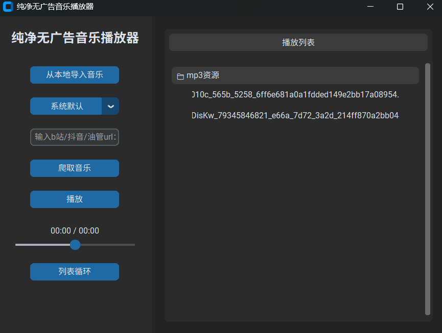

# 🎵 PureMusic Player (纯净无广告音乐播放器)

一款基于 Python 开发的现代化桌面音乐播放器。告别臃肿与广告，专注于纯粹的听歌体验。不仅支持本地多歌单的管理，还内置了某音、某站、某管音频直链解析下载功能。



## ✨ 核心特性 (Features)

* 🎧 **沉浸式本地播放**：支持 .mp3 和 .wav 格式，底层采用 Pygame 驱动。
* 📂 **动态多歌单管理**：
  * 自动识别导入的文件夹名称作为歌单标题。
  * 采用折叠面板设计，点击标题即可展开/收起歌曲列表。
* 🌐 **全网音频直链爬取**：
  * 输入视频 URL，即可在后台静默提取高品质音频并自动加入列表。
  * 内置 **10次重试机制** 与 **SSL 防断流护甲**，确保下载稳定性。
  * 效果不好（人家反爬难搞）
* ⏯️ **专业级播放控制**：
  * **丝滑进度条**：支持任意拖拽跳转，无缝衔接当前播放时间。
  * **播放模式**：支持 🔁 列表循环 与 🔂 单曲循环，放完自动切歌。
* 💾 **历史状态记忆**：采用本地 JSON 持久化存储，下次打开软件自动恢复上次加载的所有歌单。（写到这部分写累了，直接草率vibe coding了，也是唯一有注释的部分）
  
  ## 🛠️ 环境要求 (Prerequisites)
1. **Python 3.8+**
2. **FFmpeg (极其重要)**：
   * 本项目爬虫模块强依赖 FFmpeg 进行音频转码。
   * **Windows 用户**：下载并解压 FFmpeg，将其 bin 文件夹路径添加至系统 **环境变量 (Path)**。
   * **验证方法**：在终端输入 ffmpeg -version，不报错即代表成功。
     
     ## 📦 安装依赖 (Installation)
     
     在项目根目录下打开终端，运行以下命令安装必要的第三方库：
     
     ```bash
     pip install customtkinter pygame mutagen yt-dlp
     ```

```
| 库名 | 用途 |
|---|---|
| customtkinter | 提供现代化的暗色/亮色皮肤界面 |
| pygame | 负责音频播放底层驱动与事件监听 |
| mutagen | 负责读取音频精确总时长 |
| yt-dlp | 负责解析视频链接并提取音频流 |
## 🚀 启动程序 (Run)
```bash
python basicview.py
```

## 📁 项目结构 (Project Structure)

* **basicview.py** - 主程序入口，负责所有 UI 交互、折叠面板逻辑与进度条调度。
* **spider.py** - 核心爬虫模块，负责解析 URL 链接与高品质音频下载。
* **playlist_history.json** - 自动生成的历史记录文件，用于存储歌单路径。
  
  ## 🎯 使用说明 (Usage)
1. **加载歌单**：点击“从本地导入音乐”，选择文件夹后，软件将以文件夹名自动创建折叠歌单。
2. **点击切换**：点击歌单标题可收起/展开，点击 🎵 歌曲按钮直接播放。
3. **解析下载**：在左侧输入框粘贴链接，点击“爬取音乐”。完成后再次点击导入即可看到新歌。

## 🚀  部署发布 (Windows EXE 打包)

     这里用的是Pyinstaller 其他的库自己问ai咋打包

1. **安装打包工具**：
   
   ```bash
   pip install pyinstaller
   ```

```

2. **执行专业打包命令**:

 ```bash
 pyinstaller --noconfirm --onedir --windowed --name "PureMusic" --collect-all customtkinter basicview.py  ```

3. **完善发布包**：
* 进入 dist/PureMusic 目录。
* **重要**：将你系统中的 ffmpeg.exe 复制到该目录下。这样用户无需配置环境变量即可直接使用下载功能。

## 🤝 贡献与反馈 (Contributing)

如果你觉得这个小工具好用，请给我点一个 ⭐ **Star**！欢迎提交 Issue 或 Pull Request 来完善这个项目。
